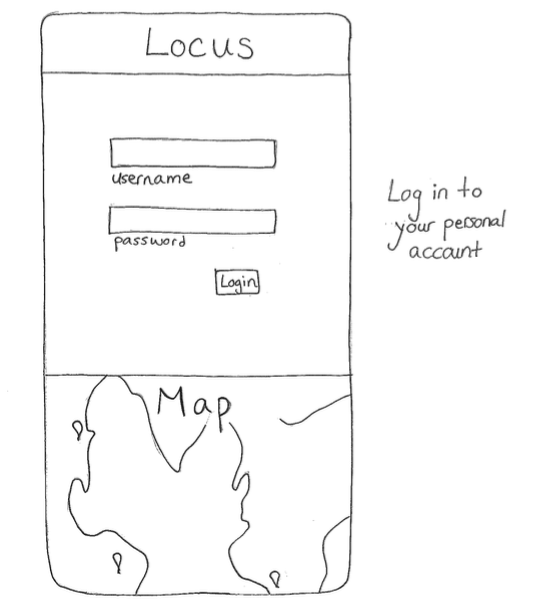
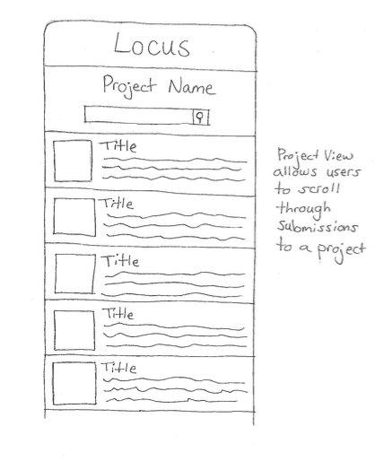
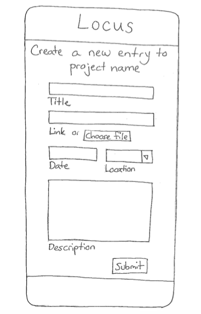
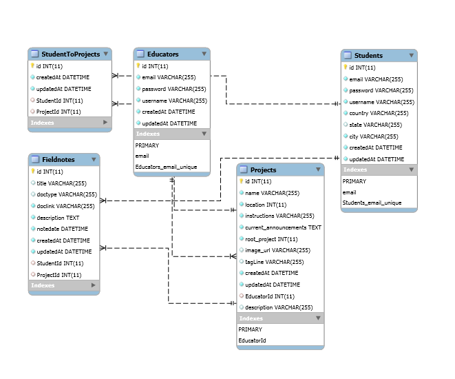

# Locus

Locus is a web application designed to encourage high school and college students to participate in science and to teach each other . It  helps students understand and enjoy science by collaborating on simple experiments with students from different parts of the globe. The application includes a form for the students to post their observations in the form of document links, data files or even pictures. This data is stored in a MySQL database and displayed on the landing page of the student. The students will also be able to view data entered by other students and post comments. 

##  Projects Page

## Form for submitting a fieldnote or data entry

## Technologies used
- Node
- Express
- MySQL
- HTML5
- JQuery
- CSS/Bootstrap
- Handlebars
- Passport
- Sequelize
- RESTful APIs

## Built With
* Sublime 
* Heroku 

Opening Screen - http://g.recordit.co/FBjnoUs0A2.gif

Student Sign Up - http://g.recordit.co/tIyDv2oADm.gif

Student Login & View - http://g.recordit.co/7KRC1zS41o.gif

## Contributers
* [Anna Kimtis](https://github.com/akimtis)
* [Kathleen Catlett](https://github.com/kathcatBC)
* [Kristen Manning](https://github.com/KristenManning)
* [Sunita Chowdhury](https://github.com/smchow)

## Opportunity
Students and educators across the world engage in scientific observation and experiments, but they rarely get the opportunity to share their discoveries with a global community. Science is only meaningful if it can be explained and shared, but often students don’t get the opportunity to experience the power of presenting their work. 

Locus allows students and educators to share their science observations with people all over the world. By sharing those observations, they can begin a discourse about science that will lead to deeper understanding of their environments and each other.

This app will be used by school classes and independent educational groups across the world. 

## Key Features
Locus allows students to quickly upload and share their observations on a project with students across the world engaged in the same project and observations. The app allows them to search through submissions and make connections.

## Competiton
Locus is unique in its ability to connect students across the globe through science projects that are student centered and engaging.

There are many apps developed for citizen science including, mPing, the Marine Debris Tracker, and Project Noah. These apps are developed to gather certain data points useful to scientists who take and analyze the gathered information. Locus is not another repository for data. Instead it is a forum for students to actively engage with each other by responding to and analyzing shared data.  

## Sketches of MVP

## Database Architecture
We are using MySQL for our database architecture.

Our tables include:
* Student to Projects
* Educators
* Fieldnotes
* Projects
* Students

Relationships between Tables:
* There are many students for many projects
* There are many projects for many educators
* There are many students for one educator
* There are many fieldnotes for one projects
* There are many fieldnotes for one student

Our database architecture will survive growth because we are hosting our app on Amazon Web Services, which will leverage cloud computing to deploy our app around the world, while keeping the it fast and agile.

## User Acquisition
To reach the first fifty users, we will use Dr. Philander’s connections with students in other parts of the world to pilot test our first project with student groups in South Africa and the United States. Next generation improvements include ways for students and educators to refer the app to their networks to build up to 1,000+ users. Educational listservs, twitter, and facebook can be leveraged to spread the success stories Locus has facilitated. Those stories will generate more interest, putting this app in the hands of administrators, educators, and scientists. 

